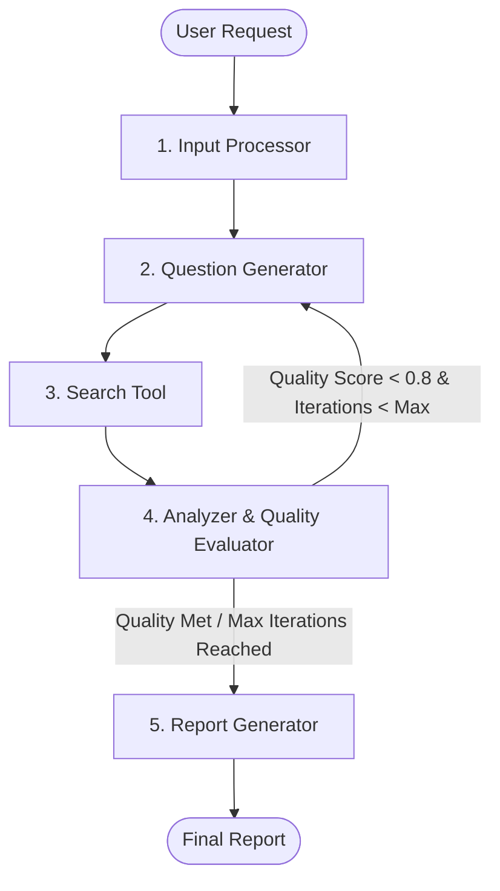

# InsightGraph 🚀
> **Autonomous Multi-Agent AI Deep Research & Report Generation Engine**

InsightGraph is an intelligent research assistant powered by **LangGraph**, **FastAPI**, and **Llama 3.3 (70B)** via Groq. It automatically breaks down topics into targeted research questions, gathers information, evaluates findings, and generates comprehensive markdown reports with real-time progress streaming.

---

## 🌟 Key Features

- 🤖 **Multi-Agent Workflow**: Specialized AI agents work in tandem to process input, generate questions, perform search queries, analyze findings, and write reports.
- 🔁 **Adaptive Feedback Loop**: Dynamic quality evaluation scores findings after each search cycle to decide whether to iterate further or compile the final report.
- ⚡ **Real-Time Status Streaming**: Streams node execution states and final outputs to the frontend using **Server-Sent Events (SSE)**.
- 🎨 **Minimalist UI**: Clean, distraction-free interface built for real-time progress visualization and markdown report viewing.

---

## 🏗️ System Architecture



### Agent Roles
1. **Input Processor**: Normalizes and refines the research topic.
2. **Question Generator**: Formulates targeted sub-questions for deep investigation.
3. **Search Tool**: Executes web queries to gather raw data and search results.
4. **Analyzer**: Synthesizes key findings and calculates a quality score.
5. **Report Generator**: Formulates a structured, detailed research report in Markdown.

---

## 📂 Project Structure

```text
InsightGraph/
├── agents/
│   ├── analyzer/         # Synthesizes findings & evaluates report readiness
│   ├── input_processor/  # Validates and structures incoming research topic
│   ├── question_gen/     # Generates multi-angle research questions
│   ├── report_gen/       # Compiles detailed final report in markdown
│   ├── search_tool/      # Integrates web search capabilities
│   └── workflow.py       # LangGraph state machine & graph compilation
├── frontend/
│   └── index.html        # Lightweight real-time SSE research UI
├── config.py             # LLM setup (Groq Llama-3.3-70b-versatile)
├── main.py               # FastAPI entry point & CORS configuration
├── routes.py             # SSE endpoint definition (/api/research)
├── state.py              # TypedDict state structure for LangGraph
├── .env.example          # Environment variables template
├── .gitignore            # Git exclusion definitions
└── README.md             # Project documentation
```

---

## 🛠️ Tech Stack

- **Framework**: FastAPI (Python 3.10+)
- **Agentic Engine**: LangGraph & LangChain
- **LLM Provider**: Groq (`llama-3.3-70b-versatile`)
- **Streaming Protocol**: Server-Sent Events (SSE)
- **Frontend**: HTML5 / Modern Vanilla CSS / JavaScript

---

## 🚀 Quick Start Guide

### 1. Clone the Repository
```bash
git clone https://github.com/YOUR_USERNAME/InsightGraph.git
cd InsightGraph
```

### 2. Set Up Virtual Environment
```bash
python -m venv .venv

# On Windows
.venv\Scripts\activate

# On macOS/Linux
source .venv/bin/activate
```

### 3. Install Dependencies
```bash
pip install fastapi uvicorn langchain-groq langgraph python-dotenv
```

### 4. Configure Environment Variables
Create a `.env` file from the provided template:
```bash
cp .env.example .env
```
Add your Groq API Key to `.env`:
```env
GROQ_API_KEY=your_actual_groq_api_key_here
```

---

## 🏃 Running the Application

### Start Backend API Server
```bash
python main.py
```
The server will start at `http://127.0.0.1:8000`.

### Open the Frontend
Open `frontend/index.html` directly in your web browser, or serve it using any HTTP server:
```bash
# Example using Python http.server
python -m http.server 3000 --directory frontend
```

---

## 📡 API Endpoint

### `GET /api/research`
Streams real-time research agent updates using Server-Sent Events (SSE).

* **Query Parameter**: `topic` (string)
* **Response**: `text/event-stream`

#### Stream Event Examples:
```json
data: {"node": "input_processor", "status": "processed"}
data: {"node": "question_generator", "status": "questions_generated"}
data: {"node": "analyzer", "status": "analyzed"}
data: {"done": true, "report": "# Final Research Report..."}
```

---

## 📜 License

Distributed under the MIT License. See `LICENSE` for details.
