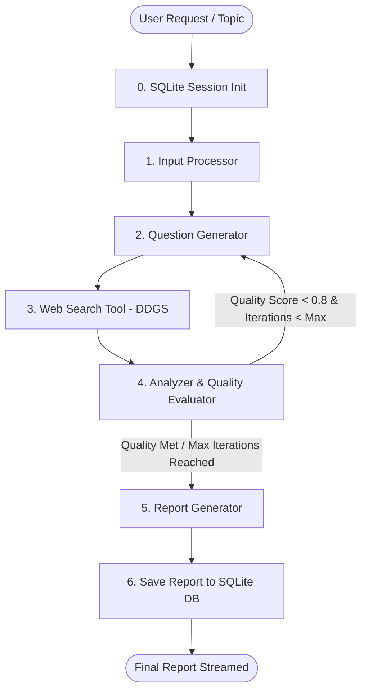

# InsightGraph 🚀
> **Autonomous Multi-Agent AI Deep Research Engine with 3D UI & SQLite Session Memory**

InsightGraph is an intelligent, autonomous research assistant powered by **LangGraph**, **FastAPI**, **SQLite**, and flexible LLMs via **Groq** (Llama 3.3 70B) or **OpenAI** (GPT-4o / GPT-4o-mini). It automatically breaks down complex topics into targeted research sub-questions, crawls live web data via `ddgs`, evaluates quality scores iteratively, and compiles structured markdown reports with real-time SSE progress streaming.

---

## 🌟 Key Features

- 🤖 **Multi-Agent Orchestration**: Specialized AI agents work in tandem (Input Processor → Question Generator → Web Search → Analyzer & Quality Evaluator → Report Generator).
- 🎨 **3D Futuristic LangUI Interface**:
  - **Three.js 3D WebGL Background**: Animated neural particle sphere reacting to mouse movements and accelerating during active research.
  - **LangUI Components**: Floating glass chat input bar, auto-resizing text area, preset prompt cards with 3D tilt animations, voice dictation (Web Speech API).
  - **Interactive Report Viewer**: Rich Markdown rendering, one-click copy, `.MD` export, Text-to-Speech read aloud, and confetti celebration fireworks upon report completion.
- 💾 **SQLite Session Memory**:
  - Persistent database recording session inputs, timestamps, status, and generated markdown reports.
  - Sidebar history navigation for loading previous research reports instantly without re-running execution streams.
- ⚡ **Multi-Provider LLM Support**: Switch between **Groq** and **OpenAI** dynamically via `.env` (`LLM_PROVIDER`, `GROQ_MODEL`, `OPENAI_MODEL`).
- 📡 **Real-Time Status Streaming**: Streams node execution states and final outputs to the frontend using **Server-Sent Events (SSE)**.

---

## 🏗️ System Architecture



---

## 📂 Project Structure

```text
InsightGraph/
├── agents/
│   ├── analyzer/         # Synthesizes findings & evaluates report readiness
│   ├── input_processor/  # Validates and structures incoming research topic
│   ├── question_gen/     # Generates multi-angle research questions
│   ├── report_gen/       # Compiles detailed final report in markdown
│   ├── search_tool/      # Integrates web search capabilities via ddgs
│   └── workflow.py       # LangGraph state machine & graph compilation
├── frontend/
│   ├── assets/           # 3D generated core visual assets
│   ├── index.html        # Single Page Application HTML5 structure
│   ├── style.css         # 3D glassmorphism & LangUI design system
│   └── app.js            # Three.js 3D canvas, SSE stream controller & speech logic
├── config.py             # Dynamic LLM provider setup (Groq & OpenAI)
├── database.py           # SQLite database schema, sessions & memory persistence
├── main.py               # FastAPI entry point & static file hosting
├── routes.py             # Session management & SSE research endpoints
├── state.py              # TypedDict state structure for LangGraph
├── requirements.txt      # Python dependencies manifest
├── .env.example          # Environment variables template
├── .gitignore            # Git exclusion definitions (excludes .env & *.db)
└── README.md             # Project documentation
```

---

## 🛠️ Tech Stack

- **Framework**: FastAPI (Python 3.10+)
- **Agentic Engine**: LangGraph & LangChain (`langchain-groq`, `langchain-openai`)
- **LLM Providers**: Groq (`llama-3.3-70b-versatile`) & OpenAI (`gpt-4o-mini` / `gpt-4o`)
- **Database**: SQLite3 (`research_sessions.db`)
- **Search Tool**: `ddgs`
- **Streaming Protocol**: Server-Sent Events (SSE)
- **Frontend**: HTML5 / Vanilla CSS3 (3D Glassmorphism) / JavaScript ES6+ / Three.js / Marked.js / DOMPurify / Canvas-Confetti

---

## 🚀 Quick Start Guide

### 1. Clone the Repository
```bash
git clone https://github.com/YOUR_USERNAME/InsightGraph.git
cd InsightGraph
```

### 2. Set Up Virtual Environment
```bash
python -m venv .venv

# On Windows (PowerShell)
.venv\Scripts\activate

# On macOS/Linux
source .venv/bin/activate
```

### 3. Install Dependencies
```bash
pip install -r requirements.txt
```

### 4. Configure Environment Variables
Create a `.env` file from `.env.example`:
```bash
cp .env.example .env
```

Edit `.env` to configure your API keys and provider preferences:

#### Option A: Groq (Default)
```env
LLM_PROVIDER=groq
GROQ_API_KEY=gsk_your_groq_api_key_here
GROQ_MODEL=llama-3.3-70b-versatile
```

#### Option B: OpenAI
```env
LLM_PROVIDER=openai
OPENAI_API_KEY=sk-proj-your_openai_api_key_here
OPENAI_MODEL=gpt-4o-mini
```

---

## 🏃 Running the Application

### Start the Server
```bash
python main.py
```
The server will start at `http://127.0.0.1:8000`.

### Open the 3D Interface
Simply open **`http://127.0.0.1:8000`** in your browser! FastAPI automatically hosts the full 3D interactive frontend.

---

## 📡 API Endpoints

### 1. `GET /api/research`
Streams real-time research agent updates using Server-Sent Events (SSE).
* **Query Parameters**:
  * `topic` (string, required): Research question or prompt.
  * `session_id` (string, optional): Session ID to attach execution results to.
* **Response**: `text/event-stream`

### 2. `POST /api/sessions`
Creates a new research session in SQLite.
* **Body**: `{"topic": "Research question"}`
* **Response**: `{"session_id": "...", "topic": "...", "status": "created", "created_at": "..."}`

### 3. `GET /api/sessions`
Retrieves all historical research sessions stored in the SQLite database.

### 4. `GET /api/sessions/{session_id}`
Retrieves session details and the saved Markdown research report.

### 5. `DELETE /api/sessions/{session_id}`
Deletes a session and its associated messages from the database.

---

## 📜 License

Distributed under the MIT License. See `LICENSE` for details.
